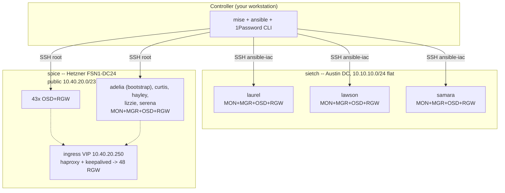

# ceph -- Ceph Tentacle on Bare Metal

Ansible automation for provisioning, deploying, tuning, hardening, and
operating Ceph Tentacle (v20) clusters on bare-metal hardware via cephadm.
Lives in the `yucca` monorepo at `ansible/ceph/`; secrets and inventory
scaffolding are provisioned from `yucca/tf/` (see `../../tf/`).

| Cluster | Partition@region | Domain | Location | Hardware | Nodes |
|---------|------------------|--------|----------|----------|-------|
| **sietch** | `staging@austin` | `staging.austin.int.futo.cloud` | Austin DC | Dell R730xd | 3 |
| **spice** | `prod@htz-fsn1` | `prod.fsn1.htz.futo.cloud` | Hetzner FSN1-DC24 | SX295 | 48 |

spice serves production traffic: 720 OSDs across the 48 nodes, 672 HDD plus 48
NVMe-backed `ssd-osd` LVs. That is an OSD count, not a disk count -- the
physical disks are 672 HDD plus 96 NVMe (two per node, mirrored into `vg0`).
Per-cluster SSH targets, vaults, and the shape differences that change a
procedure are in [docs/cluster-profiles.md](docs/cluster-profiles.md).

Clusters are declared in
`yucca/tf/deployment/<partition>/<region>/ceph/clusters.auto.tfvars`;
`terragrunt apply` plus `scripts/render-inventories.sh <partition> <region>`
writes `inventories/<partition>-<region>/<cluster>/inventory.ini` and
`secrets.yml.tpl` per cluster. The `CEPH_ENV` variable selects the active
cluster for any `mise run` or direct ansible invocation.

## Architecture



See [docs/architecture.md](docs/architecture.md) for role dependencies,
data flow, and design rationale.

## Quick Start

```bash
# 1. Render the cluster's inventory + secrets template. The stack must have
#    been applied first -- the script is read-only against TF state.
#      sietch: staging austin      spice: prod htz-fsn1
scripts/render-inventories.sh staging austin

# 2. Set up the ansible side
mise trust && mise run setup          # bootstrap dev environment

# 3. Run mise tasks against the target cluster. Export CEPH_ENV once per
#    shell (or prefix it inline). It is deliberately NOT in mise's [env]
#    block -- that would override your shell value and silently target the
#    wrong cluster; see docs/scripts.md "Setting CEPH_ENV".
export CEPH_ENV=inventories/staging-austin/sietch/inventory.ini
# ...or, for production:
# export CEPH_ENV=inventories/prod-htz-fsn1/spice/inventory.ini
mise run preflight       # TF artifacts + 1P + SSH + connectivity
mise run status          # read-only cluster health check
mise run drift           # configuration drift detection
mise run deploy          # full pipeline (idempotent)
```

An unset `CEPH_ENV` does not fail -- it falls back to sietch. Check it before
anything that writes.

See [CONTRIBUTING.md](CONTRIBUTING.md) for the full development workflow.

## Roles

| Order | Role | Description |
|-------|------|-------------|
| 1 | `provision_host` | Bare-metal Debian 12 install via debootstrap (sietch only) |
| 1 | `reprovision_hetzner` | Hetzner rescue + installimage reprovision via the Robot API (spice only) |
| 2 | `baseline` | Post-boot OS baseline: ops user, packages, /etc/hosts, services |
| 3 | `netbird` | NetBird overlay enrollment (gated by `ceph_netbird_enabled`) |
| 4 | `os_tuning` | Kernel sysctl, TCP buffers, optional centralized logging |
| 5 | `hardware_tuning` | I/O scheduler, readahead, udev rules, optional CPU governor |
| 6 | `ceph_deploy` | cephadm bootstrap, join, placement, OSDs, RGW, monitoring |
| 7 | `ceph_tuning` | Recovery throttling, scrub window, CRUSH, telemetry, audit |
| 8 | `security` | nftables firewall, SSH hardening |
| -- | `networkd` | Bond + VLAN config under systemd-networkd; applied on its own, one node at a time |
| -- | `ceph_backup` | Scheduled cluster-state backup timer on the bootstrap node |
| -- | `ceph_destroy` | Complete cluster teardown (safety-gated) |
| -- | `s3_bench` | Parallel S3 benchmark against local RGW |

## Playbooks

| Playbook | Description |
|----------|-------------|
| `site.yml` | Full pipeline: baseline + netbird + tune + deploy + tune + harden |
| `provision.yml` | Bare-metal provisioning (sietch, `-i` provision inventory) |
| `reprovision.yml` | Hetzner installimage reprovision (spice; destructive, canary first) |
| `baseline.yml` | OS baseline (users, packages, hosts) |
| `netbird.yml` | NetBird overlay enrollment |
| `tune-os.yml` | Kernel/sysctl tuning |
| `tune-hardware.yml` | Disk I/O tuning |
| `deploy-ceph.yml` | Ceph cluster deployment (tags: prerequisites, bootstrap, join, placement, lvm, osds, crush, rgw, monitoring, verify) |
| `tune-ceph.yml` | Post-deploy Ceph config tuning |
| `harden.yml` | Firewall + SSH hardening |
| `destroy-ceph.yml` | Cluster teardown (destroy inventory, requires flags) |
| `status.yml` | Quick health check (read-only) |
| `drift.yml` | Configuration drift detection |
| `bench.yml` | S3 benchmark (RGW round-trip) |
| `rados-bench.yml` | RADOS bench (raw cluster I/O, bypasses RGW) |
| `backup-config.yml` | Export cluster config for DR |
| `post-deploy-capture.yml` | Snapshot RGW TLS + admin keyring to 1P for disaster recovery |
| `rotate-certs.yml` | RGW TLS certificate rotation |
| `rotate-ssh-key.yml` | Distribute current ansible-iac pubkey from 1P to nodes |
| `migrate-networkd.yml` | One-shot networkd/bridge migration (rolling, noout-gated) |
| `hardware-inventory.yml` | Hardware facts to JSON |
| `add-node.yml` | Reimage one spice node the operator has already put into Hetzner rescue by hand (no Robot API) |
| `backup-ceph.yml` | Install the scheduled cluster-state backup timer |
| `upgrade-ceph.yml` | Health-gated cephadm cluster upgrade; explicit target image required, never run by converge |

## mise Tasks

| Task | Description |
|------|-------------|
| `setup` | Bootstrap dev environment (venv, deps, collections) |
| `lint` | yamllint + ansible-lint + shellcheck (no 1P required) |
| `check` | Syntax-check all playbooks (no 1P required) |
| `test` | Molecule tests |
| `preflight` | TF artifacts + 1P session + SSH + connectivity |
| `status` | Cluster health check |
| `drift` | Configuration drift detection |
| `deploy` | Full pipeline |
| `destroy` | Cluster teardown (interactive) |
| `backup` | Export cluster config for DR |
| `capture` | Snapshot RGW TLS + admin keyring to 1P for disaster recovery |
| `bench` | S3 benchmark (RGW round-trip) |
| `bench-rados` | RADOS bench (raw cluster I/O) |
| `rotate-certs` | RGW TLS certificate rotation |
| `rotate-ssh-key` | Distribute current ansible-iac pubkey from 1P to nodes |
| `hardware-inventory` | Capture hardware facts to JSON |
| `migrate-networkd` | One-shot networkd/bridge migration (rolling, noout-gated) |
| `netbird` | Enroll nodes into the NetBird overlay (reads the setup key from 1P) |
| `reprovision` | Hetzner installimage reprovision (destructive -- canary first) |
| `backup-timer` | Install the scheduled cluster-state backup timer on the bootstrap node |

Inventory + secrets-template scaffolding live in `yucca/tf/` -- apply the
cluster's stack under `tf/deployment/<partition>/<region>/ceph/`, then run
`scripts/render-inventories.sh <partition> <region>` to (re-)render
`inventories/<partition>-<region>/<cluster>/inventory.ini` and `secrets.yml.tpl`.

## Documentation

| Document | Audience |
|----------|----------|
| [CONTRIBUTING.md](CONTRIBUTING.md) | Developers -- setup, workflow, conventions |
| [docs/architecture.md](docs/architecture.md) | Developers -- role graph, data flow, design |
| [docs/patterns.md](docs/patterns.md) | Developers -- coding idioms, anti-patterns |
| [docs/adding-a-role.md](docs/adding-a-role.md) | Developers -- role skeleton, conventions |
| [docs/adding-a-cluster.md](docs/adding-a-cluster.md) | Developers -- inventory setup, secrets |
| [docs/secrets.md](docs/secrets.md) | Developers/ops -- 1Password integration |
| [docs/naming.md](docs/naming.md) | Everyone -- hostname and inventory naming |
| [docs/cluster-profiles.md](docs/cluster-profiles.md) | Ops -- per-cluster hosts, SSH, vaults, shape differences |
| [docs/hardware.md](docs/hardware.md) | Ops/procurement -- node specs and hardware shapes |
| [docs/s3-integration.md](docs/s3-integration.md) | App developers -- endpoints, boto3, certs |
| [docs/security-model.md](docs/security-model.md) | InfoSec -- encryption, users, firewall |
| [docs/capacity-planning.md](docs/capacity-planning.md) | Managers -- costs, formulas, growth |
| [docs/troubleshooting.md](docs/troubleshooting.md) | SRE/on-call -- symptom/diagnosis/fix |
| [docs/runbooks/](docs/runbooks/) | Ops -- add/replace node, replace disk, rotate certs/secrets/SSH/SA token, remote hands, bad-tofu-apply recovery, backup/restore |

## Known Limitations

- **Single-network topology on sietch**: public = cluster network (both
  `10.10.10.0/24`). spice splits them across fabric VLANs -- public
  `10.40.20.0/23` on VLAN 120, cluster `10.40.22.0/23` on VLAN 122 at MTU 9000.
- **spice still routes over its 1G WAN**: the default route and the ansible/SSH
  path are the 1G `enp197s0`, not the 25G bond. Ceph itself never touches it
  (daemons are pinned to the fabric networks), but a WAN outage still costs
  reachability.
- **Self-signed TLS**: RGW clients need `--no-verify-ssl`, on both clusters.
- **`ops` user is password-only**: no SSH keys installed; password sourced from 1P. Intended as an interactive console or recovery account, not for automation.
- **DNS not managed**: `s3.<domain>` and `*.s3.<domain>` records must exist externally.
