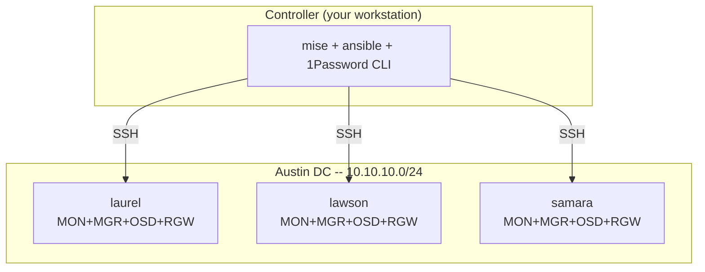

# ceph — Ceph Tentacle on Bare Metal

Ansible automation for provisioning, deploying, tuning, hardening, and
operating Ceph Tentacle (v20) clusters on bare-metal hardware via cephadm.
Lives in the `yucca` monorepo at `ansible/ceph/`; secrets and inventory
scaffolding are provisioned from `yucca/tf/` (see `../../tf/`).

| Cluster | Domain | Location | Hardware | Nodes |
|---------|--------|----------|----------|-------|
| **sietch** | `staging.austin.int.futo.cloud` | Austin DC | Dell R730xd | 3 |

Clusters are declared in `yucca/tf/deployment/staging/austin/ceph/clusters.auto.tfvars`;
`tofu apply` renders `inventories/<cluster>/inventory.ini` and
`secrets.yml.tpl` per cluster. The `CEPH_ENV` variable selects the active
cluster for any `mise run` or direct ansible invocation.

## Architecture



See [docs/architecture.md](docs/architecture.md) for role dependencies,
data flow, and design rationale.

## Quick Start

```bash
# 1. Render cluster inventories + secrets templates (once, from yucca/tf/)
(cd ../../tf/deployment/staging/austin/ceph && tofu init && tofu apply)

# 2. Set up the ansible side
mise trust && mise run setup          # bootstrap dev environment

# 3. Run mise tasks against the target cluster. CEPH_ENV must be set
#    inline (NOT via `export`) — see docs/scripts.md "Setting CEPH_ENV"
#    for why mise's [env] block strips shell exports.
CE=inventories/staging-austin/sietch/inventory.ini
CEPH_ENV=$CE mise run preflight       # TF artifacts + 1P + SSH + connectivity
CEPH_ENV=$CE mise run status          # read-only cluster health check
CEPH_ENV=$CE mise run drift           # configuration drift detection
CEPH_ENV=$CE mise run deploy          # full pipeline (idempotent)
```

See [CONTRIBUTING.md](CONTRIBUTING.md) for the full development workflow.

## Roles

| Order | Role | Description |
|-------|------|-------------|
| 1 | `provision_host` | Bare-metal Debian 12 install via debootstrap (Austin only) |
| 2 | `baseline` | Post-boot OS baseline: ops user, packages, /etc/hosts, services |
| 3 | `os_tuning` | Kernel sysctl, TCP buffers, optional centralized logging |
| 4 | `hardware_tuning` | I/O scheduler, readahead, udev rules, optional CPU governor |
| 5 | `ceph_deploy` | cephadm bootstrap, join, placement, OSDs, RGW, monitoring |
| 6 | `ceph_tuning` | Recovery throttling, scrub window, CRUSH, telemetry, audit |
| 7 | `security` | nftables firewall, SSH hardening |
| 8 | `ceph_destroy` | Complete cluster teardown (safety-gated) |
| 9 | `s3_bench` | Parallel S3 benchmark against local RGW |

## Playbooks

| Playbook | Description |
|----------|-------------|
| `site.yml` | Full pipeline: baseline + tune + deploy + tune + harden |
| `provision.yml` | Bare-metal provisioning (Austin, `-i` provision inventory) |
| `baseline.yml` | OS baseline (users, packages, hosts) |
| `tune-os.yml` | Kernel/sysctl tuning |
| `tune-hardware.yml` | Disk I/O tuning |
| `deploy-ceph.yml` | Ceph cluster deployment (tags: prerequisites, bootstrap, join, placement, lvm, osds, crush, rgw, monitoring, verify) |
| `tune-ceph.yml` | Post-deploy Ceph config tuning |
| `harden.yml` | Firewall + SSH hardening |
| `destroy-ceph.yml` | Cluster teardown (destroy inventory, requires flags) |
| `status.yml` | Quick health check (read-only) |
| `drift.yml` | Configuration drift detection |
| `bench.yml` | S3 benchmark (RGW round-trip) |
| `rados-bench.yml` | RADOS bench (raw cluster I/O, bypasses RGW) |
| `backup-config.yml` | Export cluster config for DR |
| `post-deploy-capture.yml` | Snapshot RGW TLS + admin keyring to 1P (DR belt) |
| `rotate-certs.yml` | RGW TLS certificate rotation |
| `rotate-ssh-key.yml` | Distribute current ansible-iac pubkey from 1P to nodes |
| `migrate-networkd.yml` | One-shot networkd/bridge migration (rolling, noout-gated) |
| `hardware-inventory.yml` | Hardware facts to JSON |

## mise Tasks

| Task | Description |
|------|-------------|
| `setup` | Bootstrap dev environment (venv, deps, collections) |
| `lint` | yamllint + ansible-lint + shellcheck (no 1P required) |
| `check` | Syntax-check all playbooks (no 1P required) |
| `test` | Molecule tests |
| `preflight` | TF artifacts + 1P session + SSH + connectivity |
| `status` | Cluster health check |
| `drift` | Configuration drift detection |
| `deploy` | Full pipeline |
| `destroy` | Cluster teardown (interactive) |
| `backup` | Export cluster config for DR |
| `capture` | Snapshot RGW TLS + admin keyring to 1P (DR belt) |
| `bench-rados` | RADOS bench (raw cluster I/O) |

Inventory scaffolding + secret-item provisioning live in `yucca/tf/` — run
`tofu apply` in `tf/deployment/staging/austin/ceph/` to (re-)render
`inventories/<cluster>/inventory.ini` and `secrets.yml.tpl`.

## Documentation

| Document | Audience |
|----------|----------|
| [CONTRIBUTING.md](CONTRIBUTING.md) | Developers -- setup, workflow, conventions |
| [docs/architecture.md](docs/architecture.md) | Developers -- role graph, data flow, design |
| [docs/patterns.md](docs/patterns.md) | Developers -- coding idioms, anti-patterns |
| [docs/adding-a-role.md](docs/adding-a-role.md) | Developers -- role skeleton, conventions |
| [docs/adding-a-cluster.md](docs/adding-a-cluster.md) | Developers -- inventory setup, secrets |
| [docs/secrets.md](docs/secrets.md) | Developers/ops -- 1Password integration |
| [docs/naming.md](docs/naming.md) | Everyone -- hostname and inventory naming |
| [docs/hardware.md](docs/hardware.md) | Ops/procurement -- node specs and hardware shapes |
| [docs/s3-integration.md](docs/s3-integration.md) | App developers -- endpoints, boto3, certs |
| [docs/security-model.md](docs/security-model.md) | InfoSec -- encryption, users, firewall |
| [docs/capacity-planning.md](docs/capacity-planning.md) | Managers -- costs, formulas, growth |
| [docs/troubleshooting.md](docs/troubleshooting.md) | SRE/on-call -- symptom/diagnosis/fix |
| [docs/runbooks/](docs/runbooks/) | Ops -- add/replace node, replace disk, rotate certs/secrets/SSH/SA token, remote hands, bad-tofu-apply recovery, backup/restore |
| [docs/adr/](docs/adr/) | Everyone -- architecture decision records |

## Known Limitations

- **Single-network topology**: public = cluster network on both clusters.
- **Self-signed TLS**: RGW clients need `--no-verify-ssl`. Production needs real certs.
- **`ops` user is password-only**: no SSH keys installed; password sourced from 1P. Intended as an interactive console / recovery account, not for automation.
- **DNS not managed**: `s3.<domain>` and `*.s3.<domain>` records must exist externally.
