# Architecture

How the Ceph automation in `yucca/ansible/ceph/` is shaped, what each tool
owns, and how the four tools (Terraform, 1Password, Ansible, mise) -- plus the
op CLI that resolves secrets between them -- hand off work to each other.

This is a structural reference. For step-by-step usage see
[CONTRIBUTING.md](../CONTRIBUTING.md); for narrower topics see the
specialized docs under `docs/`.

---

## 1. System context

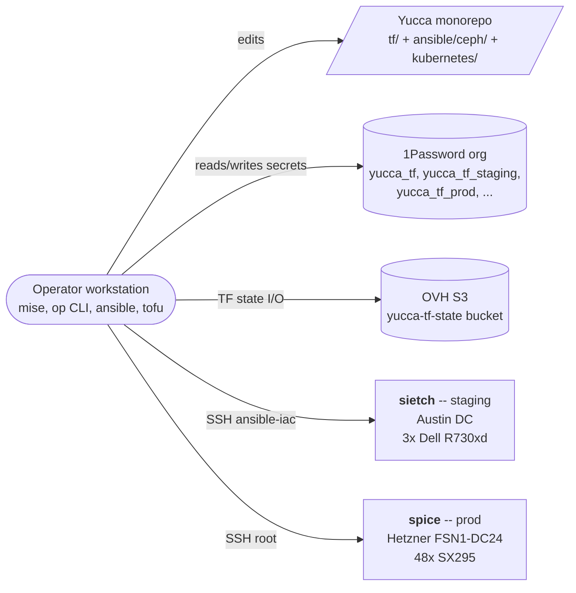

The yucca monorepo is the single source of truth for cluster identity and
configuration. Operators run mise tasks on their workstation; secrets stay
in 1Password (never on disk); TF state lives in OVH S3; Ansible drives
configuration over SSH against bare-metal Ceph nodes.

External dependencies are minimal and explicit:

- **1Password org** -- organization-scoped vaults shared with other Futo infra
  (Immich, o11y). Authoritative store for live secret values.
- **OVH S3** -- `yucca-tf-state` bucket at `s3.eu-west-par.io.cloud.ovh.net`.
  Keyed by `yucca/<partition>/<region>/<stack>/terraform.tfstate` so multiple
  stacks share the bucket without collision.
- **Hardware** -- Austin colo for sietch (3x Dell R730xd, one flat subnet);
  Hetzner FSN1-DC24 for spice (48x SX295, a 1G WAN alongside a bonded 2x 25G
  fabric with split public/cluster VLANs). Detail in
  [hardware.md](hardware.md).
- **Hetzner Robot API** -- spice only. Rescue mode plus installimage is the
  provisioning path (`reprovision_hetzner` role); there is no IPMI, so the API
  is the only remote hands short of a support ticket.
- **NetBird overlay** -- spice nodes are enrolled peers. Human SSH is
  SSO-gated through NetBird's own server; CI reaches the nodes over the
  overlay. Ansible connects over the WAN address, which holds the default
  route.

---

## 2. Partitions and regions

Partition (dev / staging / prod) and region are first-class concerns: every
tool in the mesh derives both from the same source -- directory layout
(`tf/deployment/<partition>/<region>/<stack>`) -- so isolation is structural,
not flag-driven.

| Layer        | staging / austin (live)                                 | prod / htz-fsn1 (live)                         | dev / local (planned)                          |
|--------------|---------------------------------------------------------|------------------------------------------------|------------------------------------------------|
| Cluster      | `sietch` -- 3x Dell R730xd                              | `spice` -- 48x Hetzner SX295                   | --                                             |
| TF stack dir | `tf/deployment/staging/austin/ceph/`                    | `tf/deployment/prod/htz-fsn1/ceph/`            | `tf/deployment/dev/local/ceph/`                |
| TF state key | `yucca/staging/austin/ceph/terraform.tfstate`           | `yucca/prod/htz-fsn1/ceph/terraform.tfstate`   | `yucca/dev/local/ceph/terraform.tfstate`       |
| 1P vaults    | `yucca_tf_staging`, `yucca_tf_staging_manual`          | `yucca_tf_prod`, `yucca_tf_prod_manual`       | `yucca_tf_dev`, `yucca_tf_dev_manual`         |
| Ansible inv  | `inventories/staging-austin/sietch/`                    | `inventories/prod-htz-fsn1/spice/`             | `inventories/dev-local/<cluster>/`             |
| mise default | `CEPH_ENV=...staging-austin/sietch/inventory.ini`       | overridden via env at invocation               | overridden via env at invocation               |

Two clusters are deployed today: sietch (staging / austin) and spice
(prod / htz-fsn1), which serves production traffic. They share one module, one
set of roles, and one set of mise tasks -- what differs is their
`clusters.auto.tfvars` entry and their inventory. Per-cluster hosts, SSH
targets, vaults, and the shape differences that change a procedure are
tabulated in [cluster-profiles.md](cluster-profiles.md).

Adding another region or partition is purely additive: create the matching
`tf/deployment/<partition>/<region>/ceph/` directory, populate
`clusters.auto.tfvars`, and the same module + Ansible roles + mise tasks work
unchanged. The state backend key path, 1P vault selection, and inventory
directory naming all derive from the partition + region segments.

`TF_STACK_DIR` is the operator-side override for `mise run tf:*` tasks; it
defaults to `tf/deployment/staging/austin/ceph` and points at any sibling stack directory.
`CEPH_ENV` is the matching override for Ansible -- points at the rendered
`inventory.ini` for the cluster you intend to operate on.

---

## 3. The tool mesh

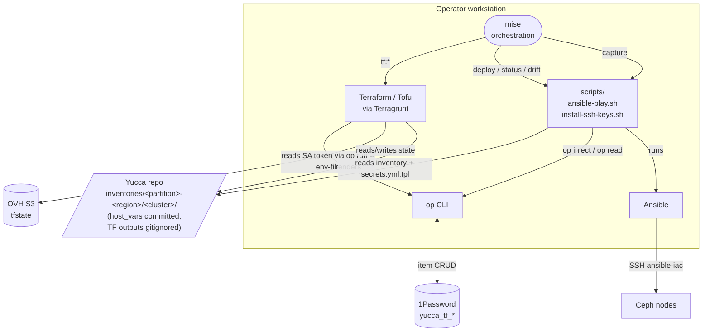

### Who owns what

| Tool          | Owns                                                                           | Reads from                                  |
|---------------|--------------------------------------------------------------------------------|---------------------------------------------|
| **Terraform** | Cluster identity, host names, rendered Ansible artifacts, TF state             | `clusters.auto.tfvars`, 1P (via op CLI)    |
| **1Password** | Live secret values, SSH keypairs, service-account tokens                       | nothing -- authoritative store               |
| **op CLI**    | Auth and resolution: env-injection, file-template injection, single-value read | 1P (session or SA token)                    |
| **Ansible**   | Convergence: applying configuration to nodes                                   | Rendered inventory + op-injected tmpfile    |
| **mise**      | Task discovery, toolchain pinning, env defaults                                | `.mise.toml`, `tf/.env`                     |

### Handoff points (the edges of the mesh)

1. **TF -> repo** -- `terragrunt apply` computes `inventory.ini`,
   `inventory-destroy.ini`, optional `inventory-provision.ini`, and
   `secrets.yml.tpl` into a `render` output;
   `scripts/render-inventories.sh <partition> <region>` writes them into
   `inventories/<partition>-<region>/<cluster>/`. These files are
   gitignored -- the source of truth is `clusters.auto.tfvars` + the
   ceph-cluster module.
2. **TF <-> op CLI** -- TF runs are wrapped with `op run --env-file=tf/.env`,
   which resolves `op://...` references in `tf/.env` and injects them as
   `OP_SERVICE_ACCOUNT_TOKEN`, `AWS_ACCESS_KEY_ID`, `AWS_SECRET_ACCESS_KEY`
   for the child process. The `tf/.env` file is committed (it contains only
   pointers, never literal secrets).
3. **Ansible <-> op CLI** -- `scripts/ansible-play.sh` reads the cluster's
   `secrets.yml.tpl`, runs `op inject -f` to resolve `op://` references into
   a `mktemp`'d tmpfile (chmod 600, trap-cleaned), then runs
   `ansible-playbook --extra-vars @<tmpfile>`. The tmpfile lives only for
   the duration of the play.
4. **mise -> wrappers** -- `mise run deploy` invokes
   `scripts/ansible-play.sh deploy.yml ...`; `mise run tf:*` invokes
   `tf/op-run.sh terragrunt --working-dir <stack> <cmd>` (op-run.sh is a thin
   `op run --env-file=tf/.env --` wrapper). mise tasks never call
   `ansible-playbook` directly.

---

## 4. Terraform (authority)

### Layout

```
tf/
|-- .env                              op:// references (committed; no literal secrets)
|-- shared/modules/ceph-cluster/      per-cluster orchestration module
|   |-- main.tf, variables.tf, outputs.tf, rendering.tf
|   `-- templates/                    inventory + secrets.yml.tpl templates
|-- shared/modules/node-names/
|   `-- wordlist.txt                  923 words for auto-picked hostnames
`-- deployment/
    |-- terragrunt.hcl                root: state backend, partition/region/stack derived from path
    |-- staging/austin/ceph/          sietch
    |   |-- terragrunt.hcl            includes root, sets ansible_project_root
    |   |-- main.tf, variables.tf, versions.tf, secrets.tf
    |   `-- clusters.auto.tfvars      declarative cluster list
    `-- prod/htz-fsn1/ceph/           spice -- same shape, plus:
        `-- spice-hosts.yaml          server_number -> WAN IP -> host_index sidecar,
                                      read by the reprovision driver and the fabric config
```

### Cluster identity is declared, not derived

The `clusters` map in `clusters.auto.tfvars` is the source of truth.
Each top-level key becomes a cluster:

```hcl
sietch = {
  domain            = "staging.austin.int.futo.cloud"
  partition         = "staging"
  region            = "austin"
  provider_code     = "int"
  role_in_hostname  = "ceph"
  ansible_ssh_user  = "ansible-iac"
  ansible_ssh_key   = "~/.ssh/id_ed25519_sietch"
  vault             = "yucca_tf_staging"
  provision_profile = "debian-live"
  hosts = [
    { name = "laurel", bond_ip = "10.10.10.90", bootstrap = true },
    { name = "lawson", bond_ip = "10.10.10.91" },
    { name = "samara", bond_ip = "10.10.10.92" },
  ]
}
```

spice's entry is the same schema with two additions the 48-node shape needs:
`provision_profile = null` (Hetzner installimage, not debian-live) and a
per-host `roles` list, which is how MON quorum is declared -- five of the 48
carry `"mon"` (adelia is bootstrap, then curtis, hayley, lizzie, serena), the
rest are `osd` + `rgw`.

The module computes everything else: hostname (`<cluster>-<role>-<name>`),
FQDN (`<hostname>.<domain>`), 1P item names
(`<CLUSTER>_CEPH_<ROLE>_PASSWORD`), inventory directory path
(`inventories/<partition>-<region>/<cluster>/`).

### Auto-naming via wordlist

For hosts where `name = null`, the module picks a stable name from the shared
923-word pool (`tf/shared/modules/node-names/wordlist.txt`) using
`random_shuffle` seeded by `(cluster_name, name_seed)`. Operator-declared names
are excluded from the pool to prevent collisions within a cluster. Adding hosts
at the tail is safe -- existing positions keep their names across applies.

Both live clusters name every host explicitly, so nothing is auto-picked today:
spice's reprovision driver needs hostnames before any apply has run, and
sietch is small enough that naming three nodes by hand costs nothing. The pool
is there for clusters that do not care what their nodes are called.

### Rendered artifacts (gitignored)

`tf/shared/modules/ceph-cluster/rendering.tf` exposes the artifacts as a
`rendered_files` output rather than writing them with `local_file` -- a
`local_file` destination path lands in shared state, which coupled that state
to whichever worktree applied last. `scripts/render-inventories.sh <partition>
<region>` reads the output and writes four files into
`inventories/<partition>-<region>/<cluster>/`:

| File                                       | Purpose                                                                                  |
|--------------------------------------------|------------------------------------------------------------------------------------------|
| `inventory.ini`                            | Normal-ops inventory: `ansible-iac` user + cluster SSH key                               |
| `inventory-destroy.ini`                    | Destroy-mode inventory (same credentials; separate file as a speed bump)                 |
| `inventory-provision.ini`                  | Provisioning inventory (only when `provision_profile != null`; uses live-image creds; the profile names the template, not the output) |
| `secrets.yml.tpl`                          | `vault_*: op://<vault>/<CLUSTER>_CEPH_*/password` pointers, consumed by `op inject -f`   |
| `group_vars/all/ceph-config.generated.yml` | `ceph_config_cluster` + `ceph_config_host` for `ceph_tuning`, from the cluster's `ceph_config` and its hosts' `ceph_config` |
| `group_vars/all/operators.yml`             | `ops_authorized_keys` from the identity registry                                          |

All of them are in `ansible/ceph/.gitignore` for every cluster.

`ceph-config.generated.yml` lands in the same directory as the committed
`vars.yml`, which is the same split `ansible/mgmt` uses (`users.generated.yml`
beside `main.yml`) and `kubernetes/` uses (`cluster-settings.generated.yaml`
beside `cluster-settings.yaml`): TF owns desired state, the committed file holds
what TF has no opinion about.

That split is load-bearing rather than stylistic. Ansible reads **every** file in
`group_vars/all/` and merges them per key, last file wins, with no deep merge
(default `hash_behaviour = replace`) -- and files load alphabetically, so
`vars.yml` sorts after `ceph-config.generated.yml`. A `ceph_config_cluster` left
behind in `vars.yml` would take the whole map and the rendered file would stop
having any effect, silently. The two keys are owned by TF exclusively; `vars.yml`
carries a pointer comment where the block used to be. Re-render with
`mise run tf:apply` followed by `scripts/render-inventories.sh` for the
partition + region you applied (`staging austin`, `prod htz-fsn1`). The script
is read-only against state, so the apply has to come first for the `render`
output to reflect the current cluster spec.

### State backend

S3 backend in `tf/deployment/terragrunt.hcl`:

- Bucket: `yucca-tf-state` (shared with o11y and other Futo stacks)
- Region: `eu-west-par` (OVH Paris)
- Endpoint: `https://s3.eu-west-par.io.cloud.ovh.net/`
- Key: `yucca/${partition}/${region}/${stack}/terraform.tfstate` -- derived
  from the child stack's path under `deployment/`
- Skip AWS-specific validation; use path-style URLs (OVH compatibility)

State locking is **not enabled today**. OVH has no DynamoDB equivalent.
OpenTofu's `use_lockfile = true` would work but expects the lockfile object
to already exist -- fresh-backend init fails with 404 before it can create
one. Single-operator workflow today; revisit when concurrent applies become
likely. See `deployment/terragrunt.hcl` for the inline rationale.

### What TF does not manage

Both ceph stacks own their generated password items: `secrets.tf` declares
`onepassword_item.ceph_password` per (cluster, secret role), titled from the
module's `secrets` output. It lives at the stack, not in the shared module, so
a stack that manages no secrets never pulls in the onepassword provider -- the
module's own copy stays parked as `secrets.tf.disabled`.

Four categories stay out of TF by design:

- **S3 service-user keys** (`*_S3_SVC_YUCCA_RESTIC_{ACCESS,SECRET}_KEY`) --
  a live contract with the restic consumer; recreating them would churn values
  the RGW is seeded from.
- **The `ansible-iac` SSH key item** -- generated with
  `op item create --ssh-generate-key`; the provider cannot generate inline and
  importing would put the private key in state.
- **DR documents** (RGW TLS cert/key, admin keyring) -- captured post-deploy by
  `mise run capture`.
- **spice's alertmanager webhook** (`SPICE_CEPH_ALERTMANAGER_WEBHOOK_URL`) --
  an externally issued Zulip receiver URL, not a generated credential. TF
  references it; managing it would overwrite the live URL with a random
  password on the next apply and silently stop alert delivery.

---

## 5. 1Password (live values)

### Vault hierarchy

| Vault                     | Purpose                                                | Who reads it                       | Who writes it                       |
|---------------------------|--------------------------------------------------------|------------------------------------|-------------------------------------|
| `yucca_tf`                | Cross-partition shared (TF state S3 creds)             | TF (via `tf/op-run.sh`)            | Operator (manual)                   |
| `yucca_tf_staging`        | staging live values (sietch)                            | Ansible runtime (op inject)        | Write SA (TF) + operator (op CLI)   |
| `yucca_tf_prod`           | prod live values (spice)                                | Ansible runtime (op inject)        | Write SA (TF) + operator (op CLI)   |
| `yucca_tf_staging_manual` | staging human-fillable placeholders (API tokens, OAuth)| Ansible runtime                    | Operator (manual)                   |
| `yucca_tf_prod_manual`, `yucca_tf_dev(_manual)` | prod + dev analogues, same shape  | per partition                      | per partition                       |

Each partition has its own live + `_manual` vault pair, and a cluster's
`vault` field in `clusters.auto.tfvars` picks the live one: sietch runs in
staging so its items live in `yucca_tf_staging`, spice runs in prod so its
items live in `yucca_tf_prod`. The `_manual` vaults exist for items that
can't be auto-generated (third-party API tokens, OAuth client secrets) --
they're populated by humans, not by TF.

### Service accounts

Each partition has a **read** and a **write** 1Password service account, scoped
to that partition's vaults. CI consumes them as GitHub repo secrets, injected
as `OP_SERVICE_ACCOUNT_TOKEN` per job -- the read token for `plan`, the write
token for `apply`:

| Partition | Read SA secret            | Write SA secret                 |
|-----------|---------------------------|---------------------------------|
| staging   | `OP_TF_YUCCA_STAGING_ENV` | `OP_TF_YUCCA_STAGING_ENV_WRITE` |
| prod      | `OP_TF_YUCCA_PROD_ENV`    | `OP_TF_YUCCA_PROD_ENV_WRITE`    |
| dev       | local-only -- no CI service account | --                      |

Locally, operators authenticate with their own 1Password desktop session
(Futo membership) rather than a service-account token. The split -- read for
plan, write for apply -- keeps drift-detection runs from holding write
authority.

Rotation procedure: [docs/runbooks/rotate-sa-token.md](runbooks/rotate-sa-token.md).

### Item categories and naming

Per cluster, the following items live in the cluster's `vault`
(`yucca_tf_staging` for sietch, `yucca_tf_prod` for spice):

| Category   | Item title pattern                                      | Field consumed       |
|------------|---------------------------------------------------------|----------------------|
| Password   | `<CLUSTER>_CEPH_OPS_PASSWORD`                           | `password`           |
| Password   | `<CLUSTER>_CEPH_DASHBOARD_PASSWORD`                     | `password`           |
| Password   | `<CLUSTER>_CEPH_GRAFANA_PASSWORD`                       | `password`           |
| Password   | `<CLUSTER>_CEPH_S3_SVC_YUCCA_RESTIC_ACCESS_KEY`         | `password`           |
| Password   | `<CLUSTER>_CEPH_S3_SVC_YUCCA_RESTIC_SECRET_KEY`         | `password`           |
| Password   | `<CLUSTER>_METRICS_WORKER_ACCESS_KEY`, `..._SECRET_KEY` | `password`           |
| Password   | `<CLUSTER>_CEPH_ALERTMANAGER_WEBHOOK_URL` (spice only)  | `password`           |
| SSH Key    | `<CLUSTER>_CEPH_ANSIBLE_IAC_SSH_KEY`                    | `private_key` / `public_key` |
| Document   | `<CLUSTER>_CEPH_RGW_TLS_CERT`, `..._RGW_TLS_KEY`       | file content         |
| Document   | `<CLUSTER>_CEPH_CLIENT_ADMIN_KEYRING`                   | file content         |

The metrics-worker keys drop the `_CEPH` segment: they belong to the
yucca-metrics-worker service, which reads bucket usage from RadosGW, not to
the Ceph cluster itself.

The `<CLUSTER>_CEPH_*` prefix is hardcoded in
`tf/shared/modules/ceph-cluster/main.tf` (`secret_prefix = "${upper(var.cluster_name)}_CEPH"`)
so every Ceph-project item across all clusters is grep-discoverable as
`*_CEPH_*` regardless of the role segment in node hostnames.

Full item-by-item catalog: [docs/secrets.md](secrets.md).

### Three op-CLI patterns

The op CLI is invoked in three distinct ways across the codebase. Each
serves a different shape of secret consumption:

1. **`op run --env-file=tf/.env -- <cmd>`** -- env-var injection.
   Resolves `op://` references in a dotenv file and injects the resolved
   values as env vars into the child process. Used for TF (SA token) and
   the S3 backend (AWS creds). Wrapped by all `mise run tf:*` tasks.
2. **`op inject -f -i <tpl> -o <out>`** -- file-template resolution.
   Reads a file containing inline `op://` references, resolves each, writes
   to the output path. Used by `scripts/ansible-play.sh` to render
   `secrets.yml.tpl` -> tmpfile. (The Hetzner installimage templates carry no
   secrets and are rendered by Ansible's `template` module, not by op.)
3. **`op read "op://<vault>/<item>/<field>"`** -- single-value read.
   Used by `scripts/install-ssh-keys.sh`, `rotate-ssh-key.yml`,
   `post-deploy-capture.yml`. Returns one value to stdout for one specific
   field; fails closed if missing.

No custom password-script (no `vault-password.sh`); no
`ansible-vault`-encrypted file in git. Lint and syntax-check tasks don't
invoke op at all -- they don't need secrets, so "1P unavailable" never
silently degrades them. This replaced an earlier `vault-password.sh` +
`ansible-vault` setup. That setup fell back to a dummy password when 1P was
unavailable, which masked real auth failures until a downstream task blew up.
The current flow fails closed instead.

---

## 6. Ansible (consumer)

### Role dependency graph

Getting a bare box to a bootable OS is a separate concern, and each cluster
takes its own route: sietch runs `provision.yml` (`provision_host`, debootstrap
from a Debian live image booted over the iDRAC virtual console), spice runs
`reprovision.yml` (`reprovision_hetzner`, Hetzner rescue mode + installimage
driven through the Robot API). Both hand off to the same convergence pipeline.
`site.yml` runs everything after that, in this order:

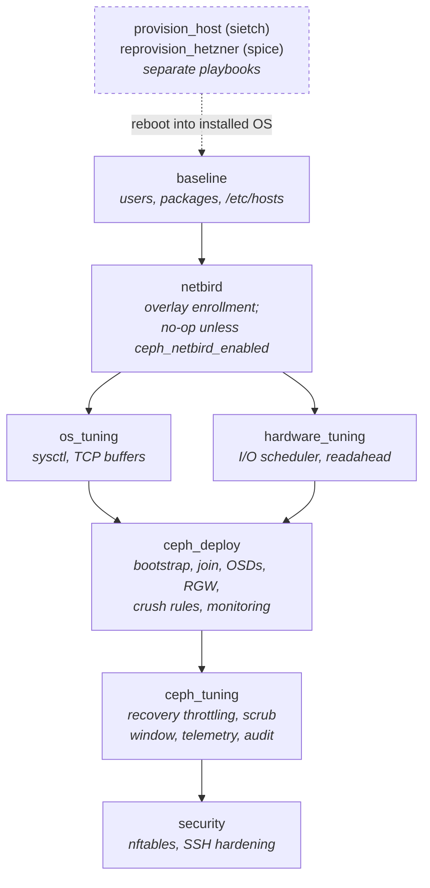

`site.yml` starts at `baseline` -- the provisioning roles run only on first
install, or on a deliberate rebuild. (The roles above are imported as per-role
playbooks: `baseline.yml`, `netbird.yml`, `tune-os.yml`, `tune-hardware.yml`,
`deploy-ceph.yml`, `tune-ceph.yml`, `harden.yml`.) The `networkd` role is not
in `site.yml`; it is applied on its own through `migrate-networkd.yml`, rolling
one node at a time behind a `noout` gate.

The split is deliberate. `provision_host` does the minimum inside the
live-image chroot -- just the `ansible-iac` user, so Ansible can connect after
reboot -- because chroot work is fragile. The ops user, packages, and
`/etc/hosts` move to the convergeable `baseline` role, which re-runs against a
live node to fix drift without reprovisioning. `reprovision_hetzner` lands in
the same place by a different road: an `autosetup` file tells installimage to
build the NVMe mdraid-1 and `vg0`, and a `post-install.sh` chroot step does
nothing but authorize the cluster key for `root` and `ansible-iac`. That
chroot step is deliberately inert -- no apt, no `lvcreate` -- because those
are the steps that broke installimage on the SX295 precedent; packages and
block.db LVs wait for post-boot convergence.

On sietch the OS is installed with `debootstrap` from the live image rather
than a preseed/autoinstall. The disk layout (mdraid-1 across two SSDs,
partitions reserved for ceph block.db and SSD OSDs) needs scripted partitioning
and pre-flight hardware validation that preseed's `partman` recipes can't
express. spice has no such freedom -- installimage owns partitioning on
Hetzner, so the block.db and `ssd-osd` LVs get carved later, by
`ceph_deploy/lvm-setup.yml`, on a booted node.

### Why this order matters

1. **baseline before tuning** -- cephadm needs podman, dbus, chrony.
   The baseline role installs these and enables the services. Running
   tuning on a node without podman would leave cephadm unable to bootstrap.
2. **tuning before deploy** -- OSD daemons inherit kernel parameters
   active at startup. Applying sysctl (`vm.min_free_kbytes`, `fs.aio-max-nr`)
   and I/O scheduler (`mq-deadline` for HDD, `none` for SSD) before bootstrap
   means daemons launch with correct limits from the first second.
3. **ceph_tuning after deploy** -- these settings use `ceph config set`
   which requires a running cluster. Recovery throttling, scrub windows, and
   PG autoscaler targets cannot be applied until MONs are up.
4. **security last** -- nftables drops all traffic not explicitly allowed.
   Running it before ceph_deploy would block cephadm's inter-node SSH,
   container image pulls, and MON/OSD port negotiation. Once the cluster is
   healthy, the firewall locks it down.

### ceph_deploy internal pipeline

`roles/ceph_deploy/tasks/main.yml` orchestrates ten phases:

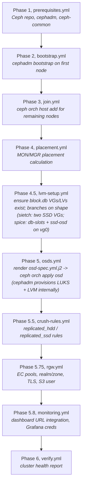

Tag-driven re-runs are first-class:
`scripts/ansible-play.sh deploy-ceph.yml --tags rgw,monitoring` re-runs
just those phases.

### Inventory layout

```
inventories/
  staging-austin/sietch/    Austin staging cluster, 3 nodes
    inventory.ini                     TF-generated, gitignored
    inventory-destroy.ini             TF-generated, gitignored
    inventory-provision.ini           TF-generated, gitignored (debian-live profile)
    secrets.yml.tpl                   TF-generated, gitignored
    group_vars/all/vars.yml           cluster-wide variables (committed)
    host_vars/                        per-node hardware topology (committed)
      sietch-ceph-laurel.yml          bond_ip, SAS path prefix, OSD maps
      sietch-ceph-lawson.yml
      sietch-ceph-samara.yml
  prod-htz-fsn1/spice/      Falkenstein production cluster, 48 nodes
    inventory.ini                     TF-generated, gitignored
    inventory-destroy.ini             TF-generated, gitignored
    secrets.yml.tpl                   TF-generated, gitignored
    group_vars/all/ceph-config.generated.yml
                                      TF-generated, gitignored; ceph_config_cluster
                                      + ceph_config_host for the ceph_tuning model
    group_vars/all/vars.yml           committed; carries the fabric VLANs, the
                                      EC profile, and the shared OSD device map
    host_vars/                        48 files, committed
      spice-ceph-adelia.yml           bond_ip, host_index, server number, mon
      ...                             flag -- no OSD map, that is in group_vars
```

There is no `inventory-provision.ini` for spice: `provision_profile = null`,
because Hetzner installimage replaces the debian-live provisioning path. The
installimage assets are role-owned (`roles/reprovision_hetzner/templates/`),
not inventory-owned, since every Hetzner cluster renders the same two
templates from its own variables.

spice inverts sietch's host_vars/group_vars balance. Its by-path OSD map is
identical on 47 of the 48 nodes, so the map lives in `group_vars` and only
`spice-ceph-miguel` overrides it (one disk sits on a different AHCI
controller). Writing 48 near-identical host_vars files would have made a
one-node exception invisible.

`host_vars/*.yml` is committed because per-node hardware facts (bond_ip,
host_index, SAS expander paths, SSD PHY positions, HDD-to-block.db mappings)
are stable inventory truth -- not operator preference. The `.local.yml` suffix
is gitignored as an escape hatch for operator-local overrides.

### Variable precedence

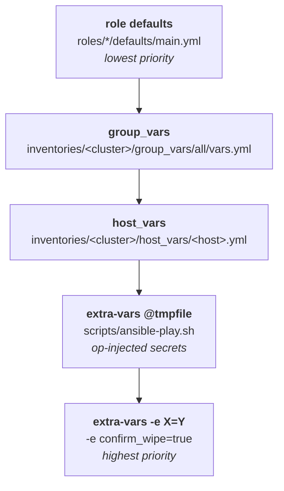

- **Role defaults** define every tunable with a safe value
  (`ceph_firewall_ssh_any_source: true`, `ceph_cpu_governor_enabled: false`).
- **group_vars/all/vars.yml** sets cluster-wide values: network topology,
  Ceph release, RGW config, monitoring ports, plus the `vault_*` ->
  consumable-name aliases (`ops_password: "{{ vault_ops_password }}"`).
- **group_vars/all/ceph-config.generated.yml** (TF-rendered) carries
  `ceph_config_cluster` and `ceph_config_host` -- the `ceph config set` desired
  state. Same precedence tier as `vars.yml`; the two never name the same key,
  because group_vars merging is last-file-wins per key rather than deep.
- **host_vars** provides per-node physical topology.
- **extra-vars from @tmpfile** carries op-injected `vault_ops_password`,
  `vault_ceph_dashboard_password`, `vault_grafana_admin_password`,
  `vault_s3_restic_access_key`, `vault_s3_restic_secret_key`, plus
  `vault_metrics_worker_*` and (spice) `vault_alertmanager_webhook_url`.
- **extra-vars via `-e`** carries safety gates: `confirm_wipe=true`,
  `provision_skip_reboot=true`, `yes_destroy_ceph=true`.

### ansible.cfg stays generic

`ansible.cfg` contains zero site-specific values. No default inventory, no
ProxyJump, no hardcoded key paths. Site-specifics live exclusively in
`clusters.auto.tfvars` (which TF renders into the inventory) or in the
inventory's `group_vars`. The same `ansible.cfg` and the same roles drive both
a 3-node SAS-expander cluster in Austin and a 48-node NVMe-RAID cluster on a
25G Hetzner fabric -- only the cluster entry in `clusters.auto.tfvars` and the
inventory's `group_vars` differ.

---

## 7. mise (orchestration surface)

### Why mise

- **Toolchain pinning** -- `.mise.toml` declares the exact versions of
  `python`, `tofu`, `terragrunt`, `op`. New operators get a working
  environment with `mise trust && mise run setup`.
- **Task discovery** -- `mise tasks` lists every operation; tasks are
  shell-script-shaped, kept in `.mise.toml`, and committed.
- **Devtools parity** -- matches the conventions in `immich-app/devtools`
  (where the `op run --env-file=tf/.env --` pattern originated).

### Task taxonomy

| Group          | Tasks                                                                    |
|----------------|--------------------------------------------------------------------------|
| Bootstrap      | `setup`                                                                  |
| Verify         | `lint`, `check`, `test`, `preflight`                                  |
| Read-only ops  | `status`, `drift`                                                       |
| State change   | `deploy`, `destroy`, `capture`, `backup`, `backup-timer`              |
| Provisioning   | `reprovision` (Hetzner installimage), `netbird` (overlay enrollment)     |
| Rotation       | `rotate-certs`, `rotate-ssh-key`                                        |
| Inventory      | `hardware-inventory`, `migrate-networkd`                                |
| Benchmarks     | `bench`, `bench-rados`                                                  |

The ceph ops tasks above live in `ansible/ceph/.mise.toml`. The `tf:*` tasks
(`tf:init`, `tf:plan`, `tf:apply`, `tf:destroy`, `tf:fmt`) live in the
yucca-root `.mise/config.toml` and run from the repo root -- they wrap
terragrunt for any stack, not just ceph.

### How mise wraps the underlying CLIs

- `mise run tf:*` -> `tf/op-run.sh terragrunt --working-dir ${TF_STACK_DIR} <cmd>` (op-run.sh = `op run --env-file=tf/.env --`)
- `mise run deploy` -> `scripts/ansible-play.sh deploy-ceph.yml ...` (per phase)
- `mise run status` -> `scripts/ansible-play.sh status.yml`
- `mise run capture` -> `scripts/ansible-play.sh post-deploy-capture.yml`

mise never invokes `ansible-playbook` or `terragrunt` directly. The wrappers
own secrets injection and pre-flight checks; mise owns task discovery and
env defaults.

### Env defaults

`CEPH_ENV` is deliberately **not** declared in `[env]` -- mise's `[env]` block
overrides shell-exported values, which would silently send an operator to the
wrong cluster. Instead each ceph ops task falls back to sietch only when
`CEPH_ENV` is unset:

```bash
# the default baked into each task
CEPH_ENV="${CEPH_ENV:-inventories/staging-austin/sietch/inventory.ini}"

# operate on another cluster by exporting once per shell, or inline:
export CEPH_ENV=inventories/prod-htz-fsn1/spice/inventory.ini
CEPH_ENV=inventories/<partition>-<region>/<cluster>/inventory.ini mise run status
```

The fallback is why spice work starts with an export. A task run without
`CEPH_ENV` set does not fail -- it quietly targets sietch, which is the whole
reason the value is not in `[env]`.

`TF_STACK_DIR` works the same way for the root `tf:*` tasks -- it defaults to
`tf/deployment/staging/austin/ceph` and is overridden per-invocation:

```bash
TF_STACK_DIR=tf/deployment/prod/htz-fsn1/ceph mise run tf:plan
```

---

## 8. Wrapper scripts (the glue layer)

The scripts under `ansible/ceph/scripts/` sit between mise and the
underlying CLIs. They exist to keep secrets out of `argv`, fail closed
when 1P is unreachable, and give better error messages than the raw tools.

| Script                  | Purpose                                                                          |
|-------------------------|----------------------------------------------------------------------------------|
| `ansible-play.sh`       | Render secrets via `op inject -f` to a `mktemp`'d file (chmod 600, trap-cleaned), then run `ansible-playbook --extra-vars @<tmpfile>` |
| `install-ssh-keys.sh`   | Idempotent `op read` -> `~/.ssh/id_ed25519_<cluster>` installer; refuses overwrite on fingerprint mismatch                                |
| `preflight.sh`          | Verifies TF artifacts present, 1P session live, SSH reachable, Python on targets -- surfaced via `mise run preflight`                    |
| `render-inventories.sh` | Writes the TF `render` output into this checkout (`<partition> <region>`, defaulting to `staging austin`); read-only against state        |

Per-script reference (synopsis, args, env, exit codes, examples):
[docs/scripts.md](scripts.md).

---

## 9. Data flow: concrete operations

### 9.1 `mise run tf:apply` -- render artifacts

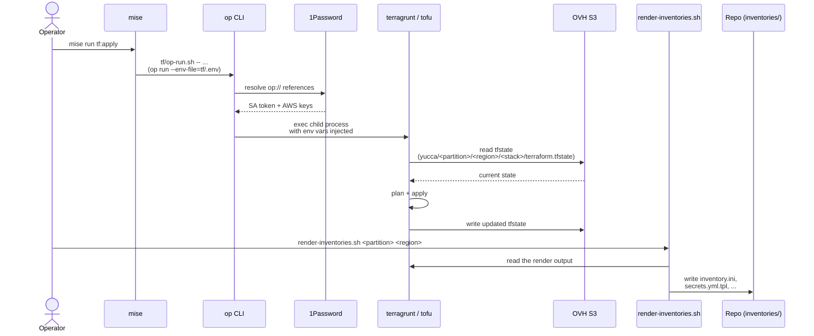

### 9.2 `mise run deploy` -- full Ceph deploy

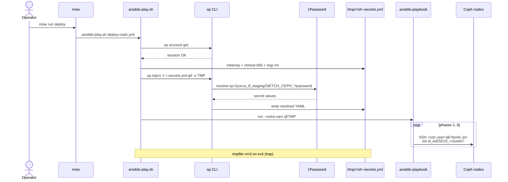

### 9.3 `mise run capture` -- DR snapshot

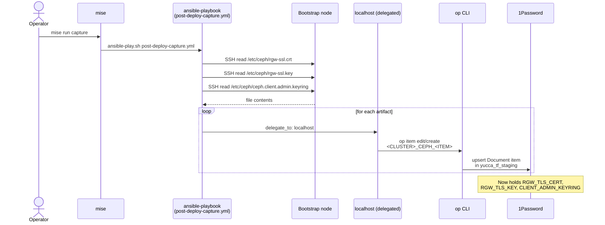

### 9.4 `scripts/install-ssh-keys.sh` -- fresh workstation

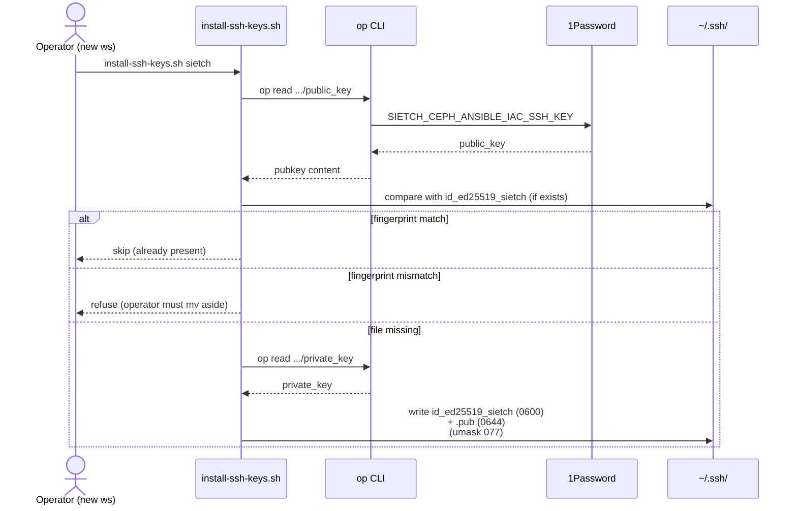

---

## 10. OSD lifecycle

### Phase flow

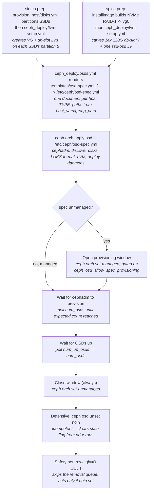

### Service-spec model, not per-disk loops

Earlier versions of this role iterated `cephadm ceph-volume lvm create`
per disk and composed `/dev/disk/by-path/...` paths from host_vars
(`sas_path_prefix` + `path_phy`). That assumed sietch's SAS expander
topology and broke on the NVMe-RAID shape's PCI-ATA disks plus LV-backed
SSD OSD.

The current flow renders a cephadm OSD service spec from per-host data
and applies it via `ceph orch apply osd -i`. Cephadm handles device
path resolution, LUKS encryption (`encrypted: true`), LVM provisioning,
and daemon deployment. The role is hardware-shape-agnostic -- the only
shape-aware logic is the template's Jinja conditional. Device paths are
listed explicitly rather than filtered by `rotational`, so cephadm never
auto-discovers and claims an OS or block.db partition.

### Hardware-shape independence in the template

`templates/osd-spec.yml.j2` renders one document per host, with two shape
branches. `ceph_osd_spec_group_by_layout` optionally collapses hosts whose
rendered device lists are identical into a single multi-host spec -- the shape
upstream recommends, and worth having for a large uniform fleet.

Both live clusters leave it off. sietch nodes have a unique SAS prefix per
chassis, so none of them would collapse. spice would collapse 47 of its 48
nodes to 3 documents instead of 96, but cannot: an OSD's owning service is
written into its LVM tags at creation (`ceph.osdspec_affinity`) rather than
derived from the spec, so applying collapsed specs leaves all 720 existing
daemons on the old names, and `ceph orch ls` fabricates a service for any
daemon whose spec is missing. Collapsing an already-built cluster therefore
adds specs without moving anything. Use the flag on a new cluster, where OSDs
are tagged with the collapsed names from the start.

The two branches are:

- **sietch-shape** (`sas_path_prefix` defined): data path =
  `/dev/disk/by-path/{{ sas_path_prefix }}-{{ path_phy }}-lun-0`; SSD
  OSD = partition on the SAS-attached SSD via `path_phy + partition`.
- **NVMe-RAID shape** (`sas_path_prefix` undefined -- spice): data path =
  `/dev/disk/by-path/{{ path_phy }}` (operator authors the full PCI-ATA
  identifier); SSD OSD = LV via the `lv` field (`/dev/{{ lv }}`).

`db_devices.paths` is always `/dev/{{ db }}` -- both shapes use LVs for
block.db, no composition needed.

The `{path_phy, db}` pairing in the inventory is presentational, not binding.
A cephadm OSD spec has no per-disk block.db field, so the template emits
`data_devices.paths` and `db_devices.paths` as two independent arrays and
ceph-volume pairs them in whatever order it processes them -- on spice it
walked the two lists in opposite directions, so disk N landed on `db-slot13-N`.
Harmless, because all 14 slots are identical 128G LVs on the same mirror; only
their count and size matter. Resolve a real pairing with
`cephadm ceph-volume lvm list`, never from the inventory.

### Idempotency

`ceph orch apply osd` is idempotent -- re-applying the same spec is a
no-op when deployed OSDs match.

Whether a spec keeps acting after that apply depends on
`ceph_osd_spec_unmanaged`. Managed (sietch, the default) it stays in cephadm's
reconcile loop and new disks -- populating an empty bay, future expansion --
are picked up automatically. Unmanaged (spice) the spec is registered and
complete but inert: cephadm will not create OSDs from it, and provisioning
needs the explicit window in `osds.yml`.

That is not a cosmetic preference. cephadm reconciles every managed spec on
every serve-loop pass, and each pass costs a `ceph-volume lvm list` plus a
`raw list` on each matching host. At spice's size that pinned one loop
iteration at ~35 minutes, so every orchestrator action inherited up to 35
minutes of latency; unmanaged, the loop runs in seconds. The tradeoff is that
a replaced disk is no longer rebuilt for you, which
[docs/runbooks/replace-disk.md](runbooks/replace-disk.md) wants anyway -- see
Ceph tracker #68436 for why letting cephadm rebuild it is the riskier path.
Existing OSDs are not destroyed by a spec apply -- removal requires
explicit `ceph orch osd rm`.

### Defensive noin handling

The spec-based flow doesn't need the `noin` flag (cephadm rolls out
OSDs gracefully one at a time). The role's tail still includes a
`ceph osd unset noin` task as a defensive cleanup -- stale `noin` flags
from a prior failed run of the older imperative flow can leave the
cluster degraded; the unconditional unset clears that safely (no-op
when already unset).

### Reweight-zero safety net

`osds.yml` ends with a task that fixes any OSD stuck at `reweight=0` by
running `ceph osd reweight <id> 1.0`. Rare with the spec-based flow but
kept as a backstop against an OSD coming up while `noin` was set
externally.

---

## 11. Monitoring

### What cephadm auto-deploys

cephadm's bootstrap automatically deploys:
- **node-exporter** on every node
- **ceph-exporter** on every node
- **prometheus** (single instance, cephadm-managed)
- **alertmanager** (single instance)
- **grafana** (single instance, with pre-built Ceph dashboards)
- **89 Prometheus alert rules** across 16 groups

### What we configure

`roles/ceph_deploy/tasks/monitoring.yml` handles only integration:

1. Enable the `prometheus` MGR module (if not already enabled)
2. Wait for all five monitoring service types to report `running > 0`
3. Set dashboard integration URLs for Prometheus, Alertmanager, Grafana
   (using the bootstrap node's `ceph_service_ip` -- which falls back to
   `bond_ip` on a flat cluster like sietch, but on spice is the fabric address
   `10.40.20.<host_index>`, so the dashboard never advertises the 1G WAN)
4. Set Grafana admin credentials from the op-injected
   `vault_grafana_admin_password`
5. Disable Grafana SSL cert verification in dashboard (self-signed cert)

`roles/ceph_tuning/tasks/main.yml` verifies the alert rule count and warns
if fewer than 10 rule groups are loaded (expects 16+).

---

## 12. Provision host internals

This is the sietch path only. spice never runs `provision_host` -- Hetzner
installimage owns partitioning there, and `reprovision_hetzner` drives it
through the Robot API (rescue -> reset -> installimage -> verify).

### Ten-phase flow

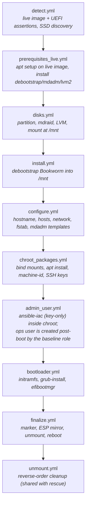

An optional `wipe-osds.yml` runs right after `disks.yml` when
`provision_wipe_osd_disks=true`, zapping prior OSD signatures off the data
disks before install -- used when rebuilding a node that was previously a Ceph
member.

### Marker-driven resume gate

After `disks.yml` runs, `main.yml` checks for
`/mnt/etc/ceph-provisioned.json`. If present and the hostname matches, all
chroot phases (4-8) plus the marker/ESP block are skipped. The role goes
straight to unmount + reboot.

This prevents:
- Re-binding bind mounts that are already in place
- Re-rotating SSH host keys (would break known_hosts)
- Re-hashing the ops password with a fresh salt
- Re-running grub-install for no reason
- Overwriting the marker with a stale `provisioned_at` timestamp

The marker filename (`ceph-provisioned.json`) is project-scoped, not
cluster-scoped -- every cluster provisioned this way writes the same filename.
The marker's *contents* identify which cluster + host the machine belongs to.

### Block/rescue cleanup

The entire provisioning sequence (phases 2-9) runs inside a `block/rescue`.
If any phase fails, the rescue block includes `unmount.yml` which tears
down chroot bind mounts and the /mnt hierarchy in reverse order, then
re-raises the failure. This ensures the next run starts from a clean mount
state.

---

## 13. CI/CD and roadmap

### Live today

- **CI / GitHub Actions** -- `.github/workflows/infra.yml` applies the
  Terragrunt stacks from CI. A `discover` job scans
  `tf/deployment/<partition>/<region>/<stack>/` into a
  `{partition, region, stack}` matrix, so adding a stack needs no workflow
  edit. `plan` runs with each partition's read SA; `apply` runs with the
  write SA, gated behind a per-region GitHub Environment with required
  reviewers (`staging-austin`, `staging-global`, `prod-global`,
  `prod-htz-fsn1`). Apply order is global (NetBird + DNS) -> site NetBird ->
  node-touching stacks (ceph / talos / fabric). Connectivity to the
  bare-metal nodes is over the NetBird overlay.
- **Talos K8s as a sibling stack** -- `tf/deployment/<partition>/<region>/talos/`
  shares the terragrunt root config and S3 backend, with its own state key
  (`yucca/<partition>/<region>/talos/terraform.tfstate`). The staging/austin
  talos stack is in the tree.
- **TF-managed `onepassword_item` resources** -- each ceph stack's
  `secrets.tf` owns the generated password items, using the partition's write
  SA. See "What TF does not manage" in section 4 for the categories that stay
  out.

### Roadmap

- **OSD LUKS keys in 1P** -- store dm-crypt keys for DR. Deferred until the
  hybrid is stable.

---

## See also

| Topic                              | Doc                                                                            |
|------------------------------------|--------------------------------------------------------------------------------|
| Per-cluster hosts, SSH, vaults     | [docs/cluster-profiles.md](cluster-profiles.md)                                |
| TF/Terragrunt detail               | [`tf/README.md`](../../../tf/README.md)                                        |
| Wrapper script reference           | [docs/scripts.md](scripts.md)                                                  |
| Secrets catalog + rotation         | [docs/secrets.md](secrets.md)                                                  |
| Trust boundaries + encryption      | [docs/security-model.md](security-model.md)                                    |
| Hardware specs + network topology  | [docs/hardware.md](hardware.md)                                                |
| Coding idioms and anti-patterns    | [docs/patterns.md](patterns.md)                                                |
| Adding a new cluster (walkthrough) | [docs/adding-a-cluster.md](adding-a-cluster.md)                                |
