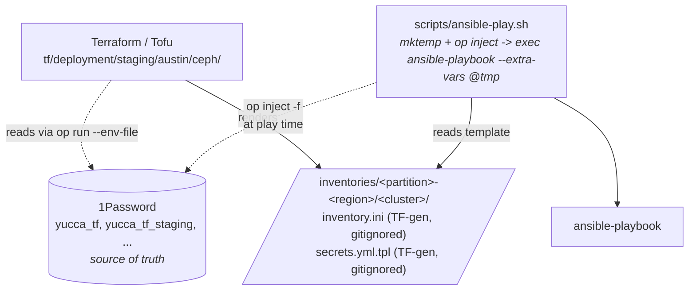

# Secrets

This project uses a **TF-provisions, op-injects, ansible-consumes** model. No
`ansible-vault`, no encrypted `vault.yml` in git, no custom password-file script.

For how secrets fit into the broader architecture, see
[architecture.md section 5 (1Password)](architecture.md).

## What lives where

| Vault                                  | Purpose                                                                                   | Who writes                                                      |
|----------------------------------------|-------------------------------------------------------------------------------------------|-----------------------------------------------------------------|
| `yucca_tf` (team-shared)               | Cross-partition shared state: TF state S3 credentials                                     | Operator (manual)                                               |
| `yucca_tf_staging` (team-shared)       | Live values for the `staging` partition (sietch today) -- `<CLUSTER>_CEPH_*` items         | Superuser service account (TF) + operator via `op` CLI          |
| `yucca_tf_staging_manual` (team-shared)| Human-fillable staging placeholders (3rd-party API tokens, OAuth client secrets) -- not yet used by ceph-cluster | Operator (manual)                    |

Each partition has the same pair; the dev and prod analogues
(`yucca_tf_dev(_manual)`, `yucca_tf_prod_manual`) land as siblings. The vault
a given cluster reads from is declared per-cluster in
`tf/deployment/<partition>/<region>/ceph/clusters.auto.tfvars` (field `vault`)
-- sietch points at `yucca_tf_staging`. TF derives item paths from that field
at render time; changing it + `tofu apply` re-renders `secrets.yml.tpl` with
the new vault path.

## Item naming

Format: `<CLUSTER>_CEPH_<ROLE>_PASSWORD`

**Password items** (category `Password`, consumed via `op inject` at
playbook time):

| Item | Field | Consumed as |
|---|---|---|
| `SIETCH_CEPH_OPS_PASSWORD` | `password` | `vault_ops_password` |
| `SIETCH_CEPH_DASHBOARD_PASSWORD` | `password` | `vault_ceph_dashboard_password` |
| `SIETCH_CEPH_GRAFANA_PASSWORD` | `password` | `vault_grafana_admin_password` |

**SSH Key items** (category `SSH Key`, consumed via
`scripts/install-ssh-keys.sh` on operator workstations and
`rotate-ssh-key.yml` on cluster nodes). SSH keys use the same storage model
as the passwords: generated natively in 1Password
(`--ssh-generate-key=ed25519`, so the private key never touches operator disk
at creation), durable across a lost laptop, and rotated forward-only --
generate a new key, distribute the public half, retire the old one:

| Item | Field | Consumed as |
|---|---|---|
| `SIETCH_CEPH_ANSIBLE_IAC_SSH_KEY` | `private_key` | `~/.ssh/id_ed25519_sietch` on operator workstation |
| `SIETCH_CEPH_ANSIBLE_IAC_SSH_KEY` | `public_key` | sietch nodes' `ansible-iac@:~/.ssh/authorized_keys` |

**S3 service-user items** (predetermined keys passed to
`radosgw-admin user create --access-key=X --secret-key=Y` at deploy
time -- Yucca app / restic client can be pre-configured with matching
credentials without waiting for post-bootstrap capture):

| Item | Field | Consumed as |
|---|---|---|
| `SIETCH_CEPH_S3_SVC_YUCCA_RESTIC_ACCESS_KEY` | `password` | `vault_s3_restic_access_key` -> `ceph_rgw_s3_user_access_key` |
| `SIETCH_CEPH_S3_SVC_YUCCA_RESTIC_SECRET_KEY` | `password` | `vault_s3_restic_secret_key` -> `ceph_rgw_s3_user_secret_key` |

**Disaster-recovery items** (populated by `mise run capture` after
deploy -- stored in 1P for recovery if the bootstrap node's filesystem
is lost):

| Item | Field | Source |
|---|---|---|
| `<CLUSTER>_CEPH_RGW_TLS_CERT` | `password` (concealed) | `/etc/ceph/rgw-ssl.crt` on bootstrap |
| `<CLUSTER>_CEPH_RGW_TLS_KEY` | `password` (concealed) | `/etc/ceph/rgw-ssl.key` on bootstrap |
| `<CLUSTER>_CEPH_CLIENT_ADMIN_KEYRING` | `password` (concealed) | `/etc/ceph/ceph.client.admin.keyring` on bootstrap |

Items get created on first `mise run capture`; subsequent runs update
in place on content drift.

Item names are derived in `tf/shared/modules/ceph-cluster/main.tf`
(`local.secret_prefix`). Hardcoded `CEPH` (not `role_in_hostname`) so every
Ceph-project secret grep-matches `*_CEPH_*` regardless of whether hostnames
use `ceph`, `osd`, or `mon` as the role segment.

## Runtime flow

The op CLI is invoked in three distinct patterns across this project:

| Pattern                    | Used by                                                                   | What it does                                           |
|----------------------------|---------------------------------------------------------------------------|--------------------------------------------------------|
| `op run --env-file=tf/.env --` | Every `mise run tf:*` task                                             | Resolves `op://` references in a dotenv file, injects as env vars into child process (TF: SA token + AWS creds) |
| `op inject -f -i tpl -o out` | `scripts/ansible-play.sh`, Hetzner installimage post-install rendering | Resolves all `op://` references in a file template, writes resolved file |
| `op read "op://..."`       | `scripts/install-ssh-keys.sh`, `rotate-ssh-key.yml`, `post-deploy-capture.yml` | Reads a single field from a single item to stdout |

### The `ansible-play.sh` flow

`scripts/ansible-play.sh` wraps every `ansible-playbook` invocation:

1. Verifies `op account get` succeeds -- fails closed if 1Password is locked.
2. `mktemp` a `0600` tmpfile with `trap` cleanup on `EXIT` / `INT` / `TERM`.
3. `op inject -f -i <cluster>/secrets.yml.tpl -o $tmpfile` -- resolves every
   `op://` reference. Exit non-zero if any reference can't be resolved.
4. `exec ansible-playbook --extra-vars @$tmpfile ...`.

Ansible task references stay unchanged -- `vault_ops_password` etc. are
regular variables populated from extra-vars (highest precedence).

Full wrapper reference: [scripts.md](scripts.md).

## CI / headless

`.github/workflows/infra.yml` sets `OP_SERVICE_ACCOUNT_TOKEN` per job from
the partition's service-account GitHub secrets -- `OP_TF_YUCCA_<PARTITION>_ENV`
(read, for `plan`) and `OP_TF_YUCCA_<PARTITION>_ENV_WRITE` (write, for
`apply`). `op inject` / `op run` pick it up automatically. `lint` and `check`
need **zero** op credentials -- they don't touch secrets -- so they run on every
PR regardless.

## Rotating secrets

See [docs/runbooks/rotate-secrets.md](runbooks/rotate-secrets.md).

## Adding a new secret

1. Add the item name to `local.secrets` in
   `tf/shared/modules/ceph-cluster/main.tf`.
2. Add the matching line to the secrets template
   (`templates/secrets.yml.tpl.tftpl`).
3. Add the ansible variable alias in each cluster's
   `inventories/<partition>-<region>/<cluster>/group_vars/all/vars.yml`.
4. Create the item manually in the target vault (or let TF do it post
   service account): `op item create --vault <vault> --category password
   --title NEW_SECRET_NAME --generate-password=letters,digits,32`.
5. `tofu apply` -- re-renders templates with the new reference.
6. Playbooks consuming the variable now have it available.
